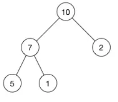
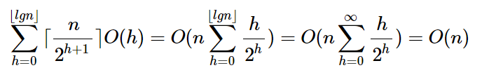

# **前言**
堆（二叉堆），一种**动态**的树型结构，一种除了底层外，**完全被填满**的**二叉树**结构。因此，堆一般是基于**数组**去实现的，它不会出现数组中很多空缺的现象，而造成空间浪费。如下是一个完全二叉树：  
<center>
      
    <br>
    <div style="color:orange; border-bottom: 1px solid #d9d9d9;
    display: inline-block;
    color: #999;
    padding: 2px;">完全二叉树</div>
</center> 

它可以用数组表示为```[10,7,2,5,1]```，若以k表示当前数组的索引，那么：
- 其父节点：```floor((k-1)/2)```
- 其左孩子：```2k+1```
- 其又孩子：```2k+2```

结合上图，**堆的性质**如下：
- 堆必须是**完全二叉树**；
- 任一节点要么比其子树节点大，要么小；
- 根据上面性质，堆被分为**最大堆**（大顶堆）和**最小堆**（小顶堆）。  

堆的**主要用途**:
- 构建优先队列；
- 支持堆排序；
- 快速找出集合中的最大值或最小值。  

堆结构的基本操作(以最大堆为例，本文均使用vector容器存储数组，假设vector容器的基本操作时间复杂度为Θ(1))：
- ```MaxHeap```：维护最大堆的性质，时间复杂度O(nlgn)；
- ```BuildHeap```：从无序的输入数据构造一个最大堆，时间复杂度为O(n)；  

# **堆结构的基本操作**
**1.MaxHeap**：  
输入一个数组A和一个下标i，使不满足最大堆性质的A[i]逐级下降，直到满足。
```
void MaxHeap(vector<int> &A, int i){
    int max; //存储父节点和其子树节点中的最大值下标
    int lef_child = 2i;      //左孩子
    int rig_child = 2i + 1;  //右孩子
    //左孩子大于父节点
    if(lef_child <= A.size() && A[lef_child] > A[i])
        max = lef_child;   
    else max = i;
    //右孩子更大
    if(rig_child <= A.size() && A[rig_child] > A[max])
        max = rig_child;  
    
    //将最大值上移至父节点
    if(max != i){
        //交换
        int temp = A[i]; A[i] = A[max]; A[max] = temp;
        //更新了数组，需继续查看当前元素是否满足最大堆性质
        MaxHeap(A, max);  
    }
}
```
因为每一个**节点**的**子树**节点数(包括孩子的孩子)至多为2n/3(n是整个树的节点数，**最坏情况即节点为根节点，且底层大于等于半满**)，所以该算法的时间复杂度为```T(n) <= T(2n/3) + Θ(1)```通过主方法求解得```T(n)=O(lgn)```，最后因为含n个元素的堆高为O(lgn)，所以其时间复杂度又可以表示为```O(h)```。   
**2.BuildHeap**：  
可以通过**自底向上**的方法，从**最后一个叶节点**开始倒序遍历，并调用MaxHeap判断当前节点子树是否满足最大堆性质。  
```
void BuildHeap(vector<int> &A){
    int i = A.size()/2; //最后一个非叶节点的位置
    for(i; i >= 0; i--)  //自底向上维护
        MaxHeap(A, i);
}
```
该算法的时间复杂度很容易通过，循环n次，每次调用MaxHeap耗费O(lgn)，从而得出```T(n)=O(nlgn)```，虽然正确，但是该算法上界还可以继续紧确。  
一个含n个元素的堆高(最底层高为0)为```floor(lgn)```，而该堆最多包含```ceil(n/2^(h+1))```个**高度为h的节点**。而一个高度为h的节点运行MaxHeap的时间复杂度为O(h)，所以可以将BuildHeap的总代价表示为：

<center>
      
</center> 

# **构建一个优先队列**
**1.什么是优先队列**  
优先队列是一种特殊的队列，它不按先进先出的原则，而是以**优先度**来弹出元素。它本质是一种用来**维护**由一组元素构成的集合S的数据结构，其中每个元素都有一个相关的值，称为**关键字**。和堆一样，优先队列也分为最大优先队列和最小优先队列。  

**2.优先队列的相关操作**  
**HeapTop**: 返回并删除掉当前堆顶，时间复杂度为O(lgn)。
```
int HeapTop(vector<int> &A){
    if(A.size() < 1) exit(0); //没有元素    
    int max = A[0];
    //堆顶等于最后一个值，并将最后一个值弹出
    A[0] = A[A.size()-1];
    A.push_pop();
    //维护最大堆性质
    MaxHeap(A, 0);
    return max;
}
```
**HeapInsert**：插入一个元素到当前堆中，时间复杂度为O(lgn)。
```
void HeapInsert(vector<int> &A, k){
    A.push_back(A[0]);
    A[0] = k;
    //维护最大堆性质
    MaxHeap(A, 0);
}
```  

# STL中堆与优先队列的实现
**1.堆**  
heap不属于STL中的容器组件，它是以算法的形式呈现，“默默扮演着幕后英雄”。heap默认是最大堆排序。使用方法如下：
```
vector<int> ivec{0, 1, 2};
//最大堆[2, 1, 0]
make_heap(ivec.begin(), ivec.end()); 
ivec.push_back(5);
//在堆的基础上进行数据插入[5, 2, 0, 1]
push_heap(ivec.begin(), ivec.end());
//pop_heap并没有删除元素，而是将堆顶元素与最后一个元素进行了替换
//[2, 1, 0, 5]
pop_heap(ivec.begin(), ivec.end());
//删除堆顶的元素[2, 1, 0]
ivec.pop_back();
//默认小堆排序[0, 1, 2]
sort_heap(ivec.begin(), ivec.end());
```
**2.优先队列**  
priority_queue是STL中优先队列的名称，默认也是最大堆排序。使用方法如下：
```
priority_queue<int> que;
que.push(x); //每次push之后会自动维护，保证堆顶是优先级别最高的
que.pop();
que.top();
```
priority_queue还可以自定义存储的数据类型以及排序方式，具体应用可以回复关键字“堆”查看。