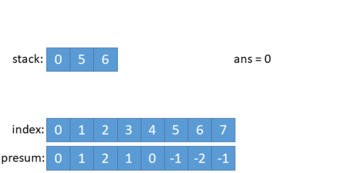
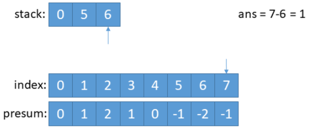

# **题目**  
给你一份工作时间表 hours，上面记录着某一位员工每天的工作小时数。  
我们认为当员工一天中的工作小时数大于 8 小时的时候，那么这一天就是「劳累的一天」。  
所谓「表现良好的时间段」，意味在这段时间内，「劳累的天数」是严格 大于「不劳累的天数」。  
请你返回「表现良好时间段」的最大长度。  
  
**示例1**：  
> **输入**: hours = [9,9,6,0,6,6,9]  
> **输出**: 3    
> **解释**:最长的表现良好时间段是 [9,9,6] 。   

# **思路**  
用```score```表示原数组工作时间大于8h的为1，其它为-1。```presum[i]```为前i+1天满足条件的次数，这样就将问题转化成求presum数组中，满足条件的最大区间。
> hours:&nbsp;&nbsp;&nbsp;&nbsp;&nbsp;&nbsp;&nbsp;&nbsp;&nbsp;&nbsp;9&nbsp;&nbsp;&nbsp;9&nbsp;&nbsp;&nbsp;6&nbsp;&nbsp;&nbsp;0&nbsp;&nbsp;&nbsp;6&nbsp;&nbsp;&nbsp;6&nbsp;&nbsp;&nbsp;9  
> score:&nbsp;&nbsp;&nbsp;&nbsp;&nbsp;0&nbsp;&nbsp;&nbsp;1&nbsp;&nbsp;&nbsp;1&nbsp;&nbsp;-1&nbsp;&nbsp;-1&nbsp;&nbsp;-1&nbsp;&nbsp;-1&nbsp;&nbsp;1  
> presum:&nbsp;&nbsp;&nbsp;&nbsp;&nbsp;&nbsp;0&nbsp;&nbsp;&nbsp;1&nbsp;&nbsp;&nbsp;&nbsp;2&nbsp;&nbsp;&nbsp;1&nbsp;&nbsp;&nbsp;0&nbsp;&nbsp;&nbsp;-1&nbsp;&nbsp;-2&nbsp;&nbsp;-1  
> &nbsp;&nbsp;&nbsp;&nbsp;&nbsp;&nbsp;&nbsp;&nbsp;&nbsp;&nbsp;&nbsp;&nbsp;&nbsp;&nbsp;&nbsp;&nbsp;&nbsp;&nbsp;&nbsp;&nbsp;&nbsp;&nbsp;&nbsp;&nbsp;↑&nbsp;&nbsp;&nbsp;&nbsp;&nbsp;&nbsp;&nbsp;&nbsp;&nbsp;↑  
> &nbsp;&nbsp;&nbsp;&nbsp;&nbsp;&nbsp;&nbsp;&nbsp;&nbsp;&nbsp;&nbsp;&nbsp;&nbsp;&nbsp;&nbsp;&nbsp;&nbsp;&nbsp;&nbsp;&nbsp;&nbsp;&nbsp;&nbsp;&nbsp;&nbsp;i&nbsp;&nbsp;&nbsp;&nbsp;&nbsp;&nbsp;&nbsp;&nbsp;&nbsp;&nbsp;j   

满足条件指**当前区间中大于8h的天数多于不大于8h的天数**，如示例中的[9,9,6]，即```presum[j] - presum[i] > 0 && (j - i)max```，```presum[j] - presum[i]```表示第i+1天到第j天中满足条件的次数。进一步转化，```presum[j] > presum[i]``` 指 **j 左边的元素小于当前元素，在这个前提下，使得j - i有最大值**。  

最后这道题就变成求下一个更大的数，即单调栈的应用，但对于本题，不是**最近**的概念（下一个），而是**最远**的概念。那可以首先遍历一遍presum来维护一个**单调递减栈**，这样栈顶元素一定是presum的最小元素。 
<center>
      
    <br>
    <div style="color:orange; border-bottom: 1px solid #d9d9d9;
    display: inline-block;
    color: #999;
    padding: 2px;">单调递减栈</div>
</center>  


接着再倒序遍历presum，如果当前的元素大于栈顶元素的话，那么这个区间合法为有效区间，我们需要记录区间大小，并且我们需要将栈顶元素弹出，然后继续比较当前遍历到的元素是不是大于栈顶元素。
<center>
      
</center>  

<center>
      
</center>   

# **解答**  
```C++
class Solution {
public:
    int longestWPI(vector<int>& hours) {
        int num = hours.size();
        if(num == 0) return 0;
        int ans = 0;
        stack<int> s;  
        vector<int> presum(num+1, 0);
        
        for(int i = 1; i <= num; i++){
            //求前缀和presum
            if(hours[i-1] > 8) 
                presum[i] = presum[i-1] + 1; 
            else
                presum[i] = presum[i-1] - 1;
            //单调递减栈
            if(s.empty() || presum[i-1] < presum[s.top()]) 
                s.push(i-1);
        }
        for(int i = num; i >= 0; i--){  //遍历最大区间
            while(!s.empty() && presum[s.top()] < presum[i]){
                ans = ans > (i - s.top()) ? ans : (i - s.top());
                s.pop();
            }
            if(s.empty()) break;
        }
        return ans;   
    }
};
```