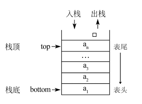
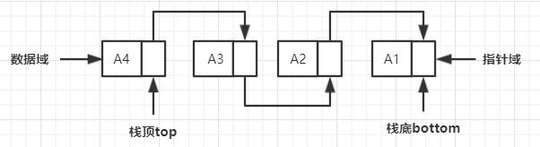

# **前言**
**栈**（stack）又称为堆栈，其作为一种数据结构，是限定**只能在表尾进行插入和删除操作的线性表**。所谓线性表是指在内存上，由零个或多个元素通过**顺序存储**或**链式存储**的有限序列，这些元素前后对应（前驱后继关系），称为**前驱元素**与**后继元素**。  

栈按照**先进后出**的原则存储数据，将允许插入与删除的一端称为栈顶（top），另一端称为栈底（bottom）。所以先进入的数据被压入栈底，最后进入的数据在栈顶，需要读数据时，从**栈顶**开始弹出数据。

栈结构的基本操作：
- ```StackPush```：进栈操作，时间复杂度O(1)；
- ```StackPop```：出栈操作，时间复杂度O(1)；  

# **栈的顺序存储结构**  
所谓顺序存储结构，即指是在**一段连续地址上开辟的内存**，因此在初始化栈时需要分配好开辟的空间大小，对应的这种栈在扩容时会比较麻烦，但它的优势在于存取时定位很方便，所以在栈大小可定的条件下，最好使用顺序结构存储。如下是一个顺序存储结构栈的示意图：  
<center>
      
    <br>
    <div style="color:orange; border-bottom: 1px solid #d9d9d9;
    display: inline-block;
    color: #999;
    padding: 2px;">栈的顺序存储结构</div>
</center>  
  
**1.栈的结构定义**：  
```C++
typedef struct stack {
    //可以是其他类型，这里假设为int
    //maxsize为栈的初始大小
    int data[maxsize];  
    //指向栈顶的索引，空栈时top为-1
    int top = -1; 
}stack;
```
   
**2.StackPush**：  
```C++
void StackPush(stack *sta, int ele){
    if(sta->top == maxsize - 1) 
        exit(0); //栈满，报错退出
    sta->top++; //栈顶索引+1
    sta->data[sta->top] = ele; //栈顶插入新值
}
```

**3.StackPop**：  
```C++
int StackPop(stack *sta){
    if(sta->top == - 1) 
        exit(0); //栈空，报错退出
    //将要删除的元素先保存下来
    int temp = sta->data[sta->top];
    sta->top--; //栈顶索引-1
    return temp;
}
```

因为两者未涉及循环，因此时间复杂度为O(1)。

# **栈的链式存储结构**  
所谓链式存储结构，即指用一组**任意的**（可连续可不连续）存储单元，通过**指针**指向，存储元素。因此链式栈会增加一些指针内存开销，但对于栈的长度是无限制的，所以对于栈中元素变化不可预测时，使用链式存储结构更好。如下是一个链式存储结构栈的示意图：  
<center>
      
    <br>
    <div style="color:orange; border-bottom: 1px solid #d9d9d9;
    display: inline-block;
    color: #999;
    padding: 2px;">栈的链式存储结构</div>
</center>  
  
**1.栈的结构定义**：  
```C++
//链表中每个节点
typedef struct stackNode {
    int data; //可以是其他类型，这里假设为int
    struct stackNode *next = nullptr;
}stackNode;

//栈的链式结构
typedef struct linkStack {
    stackNode *top; //栈顶指针
    int count = 0; //记录stack的size
}linkStack;
```

**2.StackPush**：  
```C++
void StackPush(linkStack *sta, int ele){
    //为ele创建一个节点
	stackNode *newNode = (stackNode*)malloc(sizeof(stackNode));
    newNode->data = ele;
    //将该节点的后继节点赋为栈顶指针
	newNode->next = sta->top;
    //修改栈顶指针，指向新节点
	sta->top = newNode;
    //栈的size增加
	sta->count++;
}
```

**3.StackPop**：  
```C++
int StackPop(linkStack *sta) {
    if(sta->top->next == nullptr) 
        exit(0); //栈空，报错退出
    //将要删除的元素先保存下来
    int temp = sta->top->data;
    //记录栈顶指针，便于后面释放内存
    stackNode *node = sta->top;
    //更改栈顶指针，指向下一个节点
    sta->top = sta->top->next;
    //释放删除的节点
    free(node);
    //size减1
    sta->count--;
    return temp;
}
```

因为两者未涉及循环，因此时间复杂度依然为O(1)。

# **单调栈**  
**1.概念**：  
单调栈是指**利用一些巧妙的逻辑，使得每次新元素入栈后，栈内的元素都保持有序（单调递增或单调递减）**。单调栈用途不太广泛，只处理一种典型的问题，叫做```Next Greater Element```（下一个更大的元素）。  

# **STL中栈的实现**
STL中，stack是一种关联容器，是通过简单地**修饰线性类deque（两端皆可操作，且无容量概念的容器）的接口而获得的另一种“容器类”**，往往被归结为配接器（adapter）而不是容器（container）。stack除了最顶端外，没有任何其他方法可以存取stack的其他元素，因此**stack不能遍历，所以它没有迭代器**。另外底层容器除了deque外还可采用list。  

STL中栈有以下几个成员函数，具体应用可以【关注公众号DoCode，每日一道LeetCode，将零碎时间利用起来】回复关键字“栈”查看。  
- empty() 堆栈为空则返回真
- pop() 移除栈顶元素
- push() 在栈顶增加元素
- size() 返回栈中元素数目
- top() 返回栈顶元素