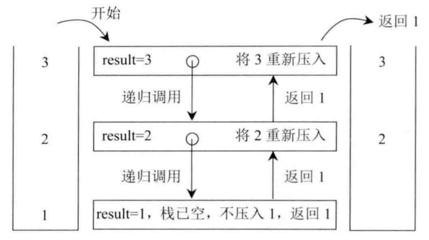
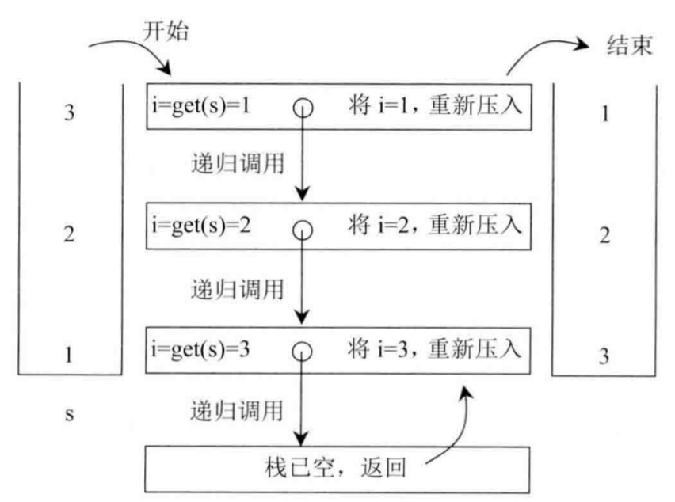

# **题目**
一个栈依次压入```1, 2, 3, 4, 5```，那么从栈顶到栈底分别是```5, 4, 3, 2, 1```。将这个栈转置后，从栈顶到栈底为```1, 2, 3, 4, 5```，也就是实现栈中元素的逆序，但是只能使用**递归函数**来实现，不能用其他数据结构。

# **思路**  
该题可以分为两个递归函数  

第一个递归函数实现**将栈stack的栈底元素返回并移除**，如果从stack的栈顶到栈底依次为3，2，1，这个函数的具体过程如下图： 
 
<center>
      
    <br>
    <div style="color:orange; border-bottom: 1px solid #d9d9d9;
    display: inline-block;
    color: #999;
    padding: 2px;">（1）</div>
</center> 

第二个递归函数负责**使用第一个递归函数来实现栈stack的逆序**，如果从stack的栈顶到栈底依次为3，2，1，该函数的具体过程如下图：

<center>
      
    <br>
    <div style="color:orange; border-bottom: 1px solid #d9d9d9;
    display: inline-block;
    color: #999;
    padding: 2px;">（2）</div>
</center> 


递归函数的3个主要的点:
- 出口条件，即递归“什么时候结束”，这个通常在递归函数的开始就写好;
- 如何由"情况 n" 变化到"情况 n+1", 也就是非出口情况，也就是一般情况——"正在"递归中的情况； 
- 初始条件，这个递归调用以什么样的初始条件开始

使用递归，切忌试图理清递归的实现过程，要把递归函数当作一个整体，一个已知条件。


# **解答** 
```C++
class MyStack {
private:
    int getAndRemoveLastEle(stack<int> &sta){
        int res = sta.top();
        sta.pop();
        if (sta.empty()) return res;  //结束点

        int last = getAndRemoveLastEle(sta);
        sta.push(res);
        return last;  //栈底元素不再压入栈中，已被移除
    }
public:
	void reverseStack(stack<int> &sta){
		if (sta.empty()) return;
		int i = getAndRemoveLastEle(sta);  //获取并移除栈底元素
		reverseStack(sta); //先取出元素
		sta.push(i);  //再添加
	}
};
```