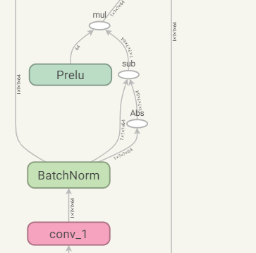

# **前言**
TensorFlow是Google团队开发的一款开源的**用于各种感知和语言理解任务**的机器学习框架。它的底层核心引擎由C++实现，但提供了Python、C++、Java、Go等常用计算机语言的接口，可谓是覆盖面很广。开发平台支持Windows、Linux和macOS。  

相较于Caffe，TensorFlow上手较难，运行速度慢，且内存耗费高，但是TensorFlow使用了**张量（tensor）运算的符号图方法，使得新网络的指定变得相当容易**，可支持快速开发，即灵活性很高。加上是Google的亲儿子，很快得到了很多人的认同。  

什么是张量运算的符号图方法？**符号图**也称作数据流图，使用tensorflow时，使用的数据（以张量存在）都得放在数据流图中进行计算。下图为一个数据流图截断：  
<center>
      
    <br>
    <div style="color:orange; border-bottom: 1px solid #d9d9d9;
    display: inline-block;
    color: #999;
    padding: 2px;">数据流图</div>
</center> 

**节点**在图中表示对数据进行相关操作，**线**则表示在节点间相互联系的多维数据数组， 即张量（tensor)。训练模型时，tensor会不断的从数据流图中的一个节点流到另一节点, 这也是TensorFlow名字的由来。  

最后提下张量，张量是矢量概念的推广，一维的张量称作**矢量或向量**，如[1, 2, 3]；二维的张量称作**矩阵**，如[[2, 3], [2, 4]]；以此类推，后面还有三维，四维等。  

# **数据流图中的基础知识**
**1.session**：  
session是一个会话控制处理模块，是Tensorflow为了控制和输出**对应执行语句**。举个栗子，考试的时候，老师在将卷子发完给所有同学之前是不可以动笔答题的（**将所有变量进行定义占位**），发完卷子后，同学们得到了通知，进行针对不同的题目进行相应的答题步骤（**将之前所有定义的变量进行赋值和计算，并针对这些变量进行一系列处理**）。  

回到Tensorflow上，上面的例子中，后序的答题过程，就是在session完成的，而启动的开关就是```session.run()```。  
```python
import tesorflow as tf

#进行定义占位，不作运算和赋值
x1 = tf.constant(3)  #定义一个常量张量
x2 = tf.constant(2)  
res = tf.multiply(x1, x2)  #乘法
#创建一个会话，并把之前所有变量进行赋值和计算
with tf.Session() as sess:
    ans = sess.run(res)
    print(ans)  #6
```

**2.Variable**：  
Variable是tensorflow中变量定义的关键字，即定义变量需要使用```tf.Variable()```。这里需要注意一点，**只要是定义了变量，就需要进行初始化**，初始化的过程就是将你定义的变量变为数据流图中使用的**张量**格式。  
```python
import tesorflow as tf

x1 = tf.Variable(3)  #定义一个变量
x2 = tf.Variable(2)
res = tf.multiply(x1, x2)

#将所有定义的变量初始化为张量
init = tf.global_variables_initializer()

with tf.Session() as sess:
    sess.run(init)  #进行激活，执行
    print(sess.run(res))  #6
```  

**3.scope**：  
scope表示域，即变量的作用域。平时在写代码过程中，因为很少会出现很多变量的情况，所以很难体现出scope的作用。而在深度学习网络中，如果不做处理，动则上百个变量是常见的，所以为了便于管理代码，推荐使用scope。下面两张图生动形象的诠释了scope的作用：  
<center>
      
    <br>
    <div style="color:orange; border-bottom: 1px solid #d9d9d9;
    display: inline-block;
    color: #999;
    padding: 2px;">使用scope之前</div>
</center> 

<center>
      
    <br>
    <div style="color:orange; border-bottom: 1px solid #d9d9d9;
    display: inline-block;
    color: #999;
    padding: 2px;">使用scope之后</div>
</center> 

TensorFlow中有两种scope，一种是**name_scope**，另一种是**variable_scope**。name_scope主要用于**管理一个数据流图里面的各种layer（也称op）**，实现一种层次化且有条理的管理，避免各个layer之间命名冲突。而variable_scope一般也可以实现name_scope的作用，但它还有一个更重要的作用，用于**管理一个数据流图中变量的名字**，避免变量之间的命名冲突。  

提到变量命名，先介绍下定义变量的方法也有两种，一种是上面提到的Variable，当在使用Variable定义变量时， 系统会**自动检测命名是否冲突并自动处理**；还有一种get_variable，使用它定义变量，当遇到要创建重名变量而**该变量名没有设置为共享变量**时，会报错。
```python
with tf.name_scope("scope1"):
    x1 = tf.Variable(name='var1', initial_value=[1], dtype=tf.float32)
    x2 = tf.Variable(name='var1', initial_value=[2], dtype=tf.float32)
    init = tf.constant_initializer(value=1) #给x3赋值
    #默认为不共享
    x3 = tf.get_variable(name='var2', shape=[1], dtype=tf.float32, initializer = init)
    #x4 = tf.get_variable(name='var2', shape=[1], dtype=tf.float32, initializer = init)

with tf.Session() as sess:
    sess.run(tf.global_variables_initializer()) #初始化
    print(x1.name)        # scope1/var1:0
    print(sess.run(x1))   # [1.]
    
    print(x2.name)       # scope1/var1_1:0
    print(sess.run(x2))  # [2.]
    
    print(x3.name)        # var2:0
    print(sess.run(x3))   # [1]
    #print(sess.run(x4))   #error
```

使用变量共享：  
```python
with tf.variable_scope("scope") as scope:
    x1 = tf.get_variable(name='var1', shape=[1], dtype=tf.float32)
    scope.reuse_variables()  # 设置为使用共享变量
    x2 = tf.get_variable(name='var1')

#或者使用 with tf.variable_scope("scope", reuse=reuse):
    
with tf.Session() as sess:
    sess.run(tf.global_variables_initializer())
    print(x1.name)        #scope/var1:0
    print(sess.run(x1))   #[0.34196675]，默认随机初始化值
    
    print(x2.name)       #scope/var1:0
    print(sess.run(x2))  #[0.34196675]
```


variable_scope的其它常见使用方式：
```python
def fun(x1, x2, scope):
    with tf.variable_scope(scope) :
        return tf.multiply(x1, x2)
    
with tf.variable_scope("fun"):
    x1 = tf.constant(1)  #定义一个常量张量
    x2 = tf.Variable(2)  #定义一个变量，后面需要初始化
    #在fun1域作运算
    res = fun(x1 = x1, x2 = x2, scope = "fun1")
    #在fun2域作运算
    res = fun(x1 = res, x2 = x2, scope = "fun2")
    #在fun3域作运算
    res = fun(x1 = res, x2 = res, scope = "fun3")

with tf.Session() as sess:
    sess.run(tf.global_variables_initializer())
    print(sess.run(res))  #16
```

<center>
      
    <br>
    <div style="color:orange; border-bottom: 1px solid #d9d9d9;
    display: inline-block;
    color: #999;
    padding: 2px;">scope的使用</div>
</center> 

上图为一个简单的scope运用。值得一提的是，可以把最外层的fun看成一个layer，里面的fun1，fun2，fun3可以替换成相应的卷积，激活操作，最后多个layer进行组合，就是一个深度学习大概的网络模型结构啦。

**4.placeholder**  
在Tensorflow中，每生成一个常量，就需要在数据流图中增加一个节点（如上图），数据量较大时，会导致图特别大。为了解决这个问题，需使用placeholder来输入数据，它相当于定义了一个位置。总结下就是，placeholder是一个占位符，用来**暂时储存变量**。将上面的代码修改为使用placeholder：  
```python
def fun(x1, x2, scope):
    with tf.variable_scope(scope) :
        return tf.multiply(x1, x2)
    
with tf.variable_scope("fun"):
    #placeholder需要定义type，一般为float32
    x1 = tf.placeholder(tf.float32)
    x2 = tf.placeholder(tf.float32)
    #在fun1域作运算
    res = fun(x1 = x1, x2 = x2, scope = "fun1")
    #在fun2域作运算
    res = fun(x1 = res, x2 = x2, scope = "fun2")
    #在fun3域作运算
    res = fun(x1 = res, x2 = res, scope = "fun3")

with tf.Session() as sess:
    #传值
    print(sess.run(res, feed_dict = {x1:2, x2:3})) #324
```

<center>
      
    <br>
    <div style="color:orange; border-bottom: 1px solid #d9d9d9;
    display: inline-block;
    color: #999;
    padding: 2px;">使用placeholder</div>
</center> 

【关注公众号**DoCode**，每日一道LeetCode，将零碎时间利用起来】