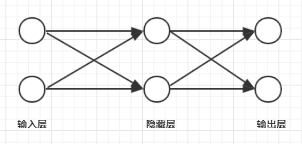
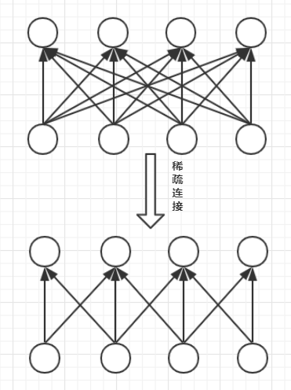

# **前言**
**卷积神经网络（CNN）**，也称为卷积网络，是一种专门用来处理具有类似**网格结构**的数据的神经网络，如时间序列数据（一维网格）和图像数据（二维像素网格），主要应用于图像识别领域。它也是一种**前馈神经网络**，是指在该网络中，各神经元从输入层开始，接收前一级输入，并输出到下一级，直至输出层，整个网络中无反馈，如下所示：

<center>
      
    <br>
    <div style="color:orange; border-bottom: 1px solid #d9d9d9;
    display: inline-block;
    color: #999;
    padding: 2px;">前馈神经网络</div>
</center> 

卷积神经网络一般含有多个**卷积层**，**池化层**，以及**激活层**和**全链接层**。

# **卷积层的一些小事**
> 在卷积神经网络中，将一个卷积过程定义为```y = x * w```，其中x是**输入**（input），w是**卷积核**（kernel）函数，y作为输出也称作**特征映射（feature map）**。围绕这个等式，探讨下卷积神经网络相较传统神经网络的三个改进点：**稀疏交互**、**参数共享**以及**等变表示**。

<center>
      
    <br>
    <div style="color:orange; border-bottom: 1px solid #d9d9d9;
    display: inline-block;
    color: #999;
    padding: 2px;">一个卷积过程，4*4蓝色平面上的3*3阴影为卷积核，2*2为输出结果y</div>
</center> 

**1.稀疏交互**  
也称作稀疏（sparse）连接或稀疏权重。

先举个栗子：
> 当处理一张图片时，输入的图像可能包含成千上万个像素点，但是通过与等式中的**w核**卷积后，就可以得到这张图中有意义的特征（例如图像的边缘信息)，相比输入图，提取出特征图的像素点大大减少，并且该kernel只占有几十到上百个像素，这个过程就可以理解为**稀疏交互**。  


再举个栗子：
> 如果有m个输入和n个输出，那么使用传统神经网络（矩阵乘法）需要m*n个参数，从而学习一次的时间复杂度为```O(m*n)```。而如果**限制**每一个输出拥有的连接数为k，则该方法学习一次的时间复杂度为```O(k*n)```，k只需比m小几个数量级即可。

<center>
      
    <br>
    <div style="color:orange; border-bottom: 1px solid #d9d9d9;
    display: inline-block;
    color: #999;
    padding: 2px;">稀疏连接，每幅图从下往上看</div>
</center> 

应用于图像，就是经过卷积操作的网络，**不再是对每个像素的输入信息做处理了，而是对图片上每一小块像素区域进行处理**。  

总结下就是，卷积网络的稀疏交互特性，**使得模型存储的参数更少，不仅节省了内存，也提高了统计效率**。更进一步，该特性使得，得到输出结果所需要的计算量更少了，以及提高了模型的**泛化能力**。  

**2.参数共享**  
在传统的神经网络中，**权重矩阵**的每个元素对*对应的输入元素*只使用一次，而在卷积网络中，**核**的每个元素都作用在输入的每个位置上。**参数共享**特性保证了网络**只需要学习一个参数的集合，而不是对每个位置都学习一个单独的参数集合**。同样，参数共享特性也降低了模型的存储大小，毕竟不是每个元素都学习一个参数。  

**3.等变表示**  
参数共享使得神经网络具有对平移**等变**的性质（如果一个函数满足输入改变，输出也以同样方式改变，则该函数是等变的）。对于卷积函数，**先进行平移变换再进行卷积**所得到的结果和**先做卷积再做平移变换**得到的结果是一样。  


简单地说，**如果移动输入中的对象。那它卷积后的特征表示也会移动同样的量**。例如，输入图像的左上角有一个人脸，那经过卷积，人脸的特征（眼睛，鼻子）也位于特征图的左上角。对应的如果人脸特征在图像的左下角，那么卷积后对应的特征也在特征图的左下角。**等变性意味着即使目标的外观发生了某种变化，但是网络依然可以把它识别出来**，这也是卷积网络学习能力的体现。

**4.TensorFlow中的卷积函数**  
一个卷积核只能提取某一个特征，多个卷积核就能提取多个丰富的特征（至于为什么卷积操作可以提取特征，会在池化层中介绍），所以经常见到一个卷积网络中有许多的卷积操作。  

TensorFlow中对卷积等一些列操作进行了很多封装（tf.nn、tf.layers、tf.contrib，它们的封装程度依次递增），但大体的用法是差不多的。一般一个卷积函数的基本参数包括以下几个（其他参数可以访问[tensorflow官方文档](https://tensorflow.google.cn/)查看）：
- **输入**：一个4维tensor，第一维表示batch-size（训练一次输入的样本量），后面几维表示图像样本的长、宽以及通道数（深度）。
- **卷积核（过滤器）**：描述卷积核的size，深度（卷积核的个数）。
- **步长**：卷积核每次移动的距离
- **填充**：是否对边缘进行填充（填充的目的可以保证卷积后，输入输出的大小不变）

举个栗子：
```python
import tensorflow as tf
import numpy as np

#初始化一个形状为3*3的矩阵，并调整输入的格式为(1, 3, 3, 1)
matrix = np.array([[[2],[1],[2]],
                   [[1],[4],[2]],
                   [[1],[1],[0]]],
                  dtype="float32").reshape(1, 3, 3, 1)

#创建一个2*2的卷积核，并为其赋上基础权重
#第三个维度的1表示当前层的深度，第四个维度的1表示卷积核的数量
kernel = tf.get_variable("weights", [2, 2, 1, 1], 
                         initializer = tf.constant_initializer([[1, 2],[2, 1]]))

#开始卷积
#先创建一个占位输入
x = tf.placeholder('float32', [1, None, None, 1])
#卷积，选择的是不填充-VALID，填充为SAME，步长每个通道为1
conv = tf.nn.conv2d(x, kernel, strides=[1, 1, 1, 1], padding="VALID")

init = tf.global_variables_initializer()
with tf.Session() as sess:
    sess.run(init)
    conv = sess.run(conv, feed_dict={x: matrix})
    #（1，2，2，1）
    print("The shape of matrix after conv：", conv.shape) 
    #10, 15
    #12, 10
    print("Matrix after conv: \n", conv) 
```
**卷积输出尺寸**可由公式```out = (i + 2p - k)/s + 1```计算，其中，i为输入图像的尺寸，p为填充的宽度，k为卷积核的size，s为步长的长度。

# **总结**
卷积网络中的**卷积过程**可以理解为：  

有一个卷积核（过滤器）, 持续不断的在输入图片上移动，如图二所示，每次移动都会收集一小块像素区域的信息（特征值），当遍历完整张图，就提取出了这张图片的**低层次特征**。  

然后再以同样的步骤，用类似的卷积核再去卷积上一次提取到的低层次特征，CNN就可以从这些低层次特征中总结出**更高层的特征信息**。当然中间少不了**池化层**和**激活层**的帮助。

【关注公众号**DoCode**，每日一道LeetCode，更有其他学习内容，将零碎时间利用起来】