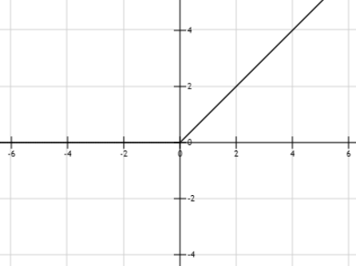
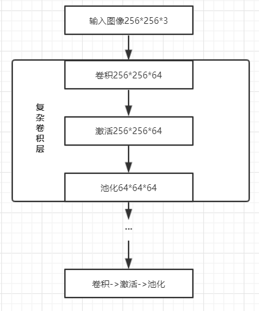

# **前言**
 一个**卷积层**一般分为三个部分。第一部分为**卷积级**，卷积操作可参照上节的示例，作用是进行特征的提取，但这里提取出的特征是线性的，不具有学习“能力”。为了使卷积网络具有学习能力，就需要下面介绍第二第三部分**激活级**与**池化级**。  
 
 值得说明的是，本文提到的卷积层是将卷积、激活、池化视为一个复杂的层，当然卷积神经网络中，也可以将这三层分开视为三个简单的层，这样就意味着不是每一层都有weights与bias。  

# **激活级**
**1.概念**

卷积级输出的线性“特征”会进行一个非线性函数处理，且该处理不会改变输入数据的size，我们把这一个函数称为激活函数，而这一步称为激活级（层）。  

在生物里，只有当前面的树突传递的信号的加权和值大于某一个特定的阈值时，后面的神经元才会被激活。对应卷积神经网络中，就是**输入的特征值大于某个阈值时，才会进行特征保留**，而不满足阈值的特征，输出就为0。  

换句话说就是，只有图中的某块区域特征强度达到一定标准时，才表明这块区域的特征具有学习的意义，而强度弱的区域不会影响到对该图片的识别。再换句话说就是，如果没有激活函数，就算特征很弱，仍然可以得到输出，后面的层次继续把这个输出当成一个特征使用，这反而会对网络的学习能力起到负作用。  

**2.激活函数**  

激活函数有很多，如sigmoid、relu、tanh、abs等，这里主要介绍常用的relu激活函数，可以说是非常常用了，其余的可以参考其他说明。  

ReLu激活函数的表达式为```f(x) = max(0, x)```，如下图所示：  

<center>
      
    <br>
    <div style="color:orange; border-bottom: 1px solid #d9d9d9;
    display: inline-block;
    color: #999;
    padding: 2px;">relu激活函数</div>
</center>   

ReLu函数表示小于0的特征值，输出0，其余输出该特征值。该激活函数主要优点就是函数的计算量小，其次收敛速度快，而且效果还很好，因此是当前最热门的激活函数。

在tensorlow中，将卷积层与激活层进行了封装，可以直接在参数中进行选择激活函数，如下：  
```python
#默认为nn.relu，即max(0,x)
slim.conv2d(..., activation_fn=, ...)
```
当然也可以指定自己写的激活函数，可以用来修改阈值：  
```python
#自定义relu的阈值
def lrelu(x, coef=0.2):
    return tf.maximum(x, coef * x)
    
#使用
slim.conv2d(..., activation_fn=lrelu, ...)
```

# **池化**  
**1.概念**  
池化层的操作是：**使用特征区域中某一位置的相邻输出来代替网络在该特征区域的输出**。池化操作和卷积操作一样，会改变输入数据的size，当然也可以通过更改stride和padding使得size不变。  

池化层有一个很重要的性质就是**平移不变性**，即不管卷积网络采用什么样的池化函数，当输入做出少量平移时，池化能够使得输入得表示近似不变，具体可参考上节的**等变表示**。该性质可以很好的使得，我们不用去关心的某个特征出现的位置，而只需要去关心它是否出现。当然，池化层不适用于对位置的区分很重要的领域。  

同时，池化操作由于综合了池化区域k个像素的统计特征而不是单个像素，即下一层的输入相当于少了k倍数据量，对应的数据量少了，网络的**计算效率**也可以提高且减少了参数的**存储要求**。数据量的减少变相的也使得网络的**泛化能力**提高，对防止网络过拟合也起到了一定的作用。  

**2.池化函数**  
一般提及池化层，指的就是最大池化和平均池化，对于其它池化函数如L^2范数池化，加权平均池化可以参考其它介绍。  

最大池化(max pooling)即用池化区域最大值代表该区域的总体特征，它可以更好的**保留图像纹理信息**。tensorflow中使用如下：  
```python
#指定卷积核大小与步长
slim.max_pool2d(inputs=, kernel_size=, stride=)
```

而平均池化(mean pooling)即用池化区域的平均值表示该区域的总体特征，它可以更好的**保留图像的背景信息**。tensorflow中使用如下： 
```python
slim.avg_pool2d(inputs=, kernel_size=, stride=)
``` 

# **总结**
一个卷积层可以由一个卷积级、一个激活级以及一个池化级构成，卷积层的作用主要是对输入数据进行“特征”提取。分开来说，卷积负责对输入数据线性操作，激活负责进行非线性处理，池化用于减少特征数量。最后用一个简单的流程图总结下复杂卷积层的处理过程：  

<center>
      
    <br>
    <div style="color:orange; border-bottom: 1px solid #d9d9d9;
    display: inline-block;
    color: #999;
    padding: 2px;">卷积层结构图</div>
</center>  

【关注公众号**DoCode**，每日一道LeetCode，更有其他学习内容，将零碎时间利用起来】