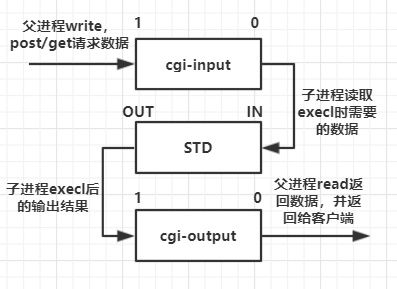

# **注意事项**
- index.html必须没有执行权限，否则不能显示内容，可通过**chmod 600 index.html**更改。  
- 编译**gcc server.c -o server -lpthread**
- **myhttp文件**是tinyhttp与epoll反应堆结合后的代码，使用方法相同。
# **主函数**  
1.服务器端初始化：  
> 创建socket -> 设置端口复用 -> 绑定socket与服务器地址 -> 如果未指定端口，动态分配 -> 监听  

```C
int on = 1;
unsigned int port = 4000;
struct sockaddr_in name;
int lfd = socket(PF_INET, SOCK_STREAM, 0);  //创建socket
memset(&name, 0, sizeof(name));  //初始化name
name.sin_family = AF_INET;
name.sin_port = htons(*port);
name.sin_addr.s_addr = htonl(INADDR_ANY);
setsockopt(lfd, SOL_SOCKET, SO_REUSEADDR, &on, sizeof(on)) //端口复用
bind(lfd, (struct sockaddr *)&name, sizeof(name))
if (*port == 0) {   //动态分配端口
    socklen_t namelen = sizeof(name);
    getsockname(lfd, (struct sockaddr *)&name, &namelen);
    *port = ntohs(name.sin_port);
}
listen(httpd, 5);
```

2.服务器**阻塞**等待客户端连接，一旦连接，开辟一个线程并执行对应响应函数： 

```C
while(1) {
    client_sock = accept(server_sock, (struct sockaddr*)&client_name, &client_name_len);
    printf("received from %s at PORT %d\n", 
            inet_ntop(AF_INET, &client_name.sin_addr, str, sizeof(str)), 
            ntohs(client_name.sin_port));
    pthread_create(&newthread , NULL, (void *)accept_request, (void *)(intptr_t)client_sock);
}
```

# **响应函数**  
1.获取请求方法： 

<center>
      
    <br>
    <div style="color:orange; border-bottom: 1px solid #d9d9d9;
    display: inline-block;
    color: #999;
    padding: 2px;">请求报文</div>
</center>

上图所示是一个**http请求的报文格式**，**请求方法**是指上图中请求行中第一个字段。

```C
int i = 0; 
char buf[1024];
char method[255];
/*get_line返回获取到的字节数*/
int numchars = get_line(client_sock, buf, sizeof(buf)); 

/*不为空，以及未到达上限，将buf中Get或Post拷贝进method*/
while (!isspace((int)buf[i]) && (i < sizeof(method) - 1)) { 
    method[i] = buf[i];
    i++;
}
method[i] = '\0';
```

<font color=#ff0000>**注意**：如果既不是post也不是get请求，报错退出；另外值得注意的是报文中的空格值为"\r\n"。</font>  
    
2.获取url： 

<center>
      
    <br>
    <div style="color:orange; border-bottom: 1px solid #d9d9d9;
    display: inline-block;
    color: #999;
    padding: 2px;">一个URL格式</div>
</center>

上图所示是一个常见的**URL**，而请求行中的url指的是上图**resource path**，在请求头部中会包含host字段。

```C
int j = i;
i = 0;
char url[255];
while (isspace((int)buf[j]) && (j < numchars)) j++;  //跳过空格

/*取出报文头的url，该url不包含host*/
while (!isspace((int)buf[j]) && (i < sizeof(url) - 1) && (j < numchars)) {
    url[i] = buf[j];
    i++; j++;
}
url[i] = '\0';
```
3.设置cgi值（可以理解为一个标志位）：   
- 如果是**post请求**, cgi=1;  
- 如果是**带参数的get请求**, cgi=1, 并使用一个指针指向参数;
- 如果url指向的地址是**可执行文件**, cgi=1;    
- 其余情况cgi=0;  
  
4.组合url，让其指向服务器上的一个绝对路径（path），如果path是一个目录（文件夹），修改path指向默认的主页地址，**path = host+url**。  
5.使用stat函数绑定path：  
> **失败**，即路径错误，将剩余请求内容读出并丢弃，返回404错误；  
> **成功**，若**cgi != 1 (get无参请求)**, 直接将path内容读出并send回客户端；若**cgi == 1, 执行cgi脚本，函数参数:client_sock, path, method, query(get请求的请求参数)。

# **cgi脚本函数**  
- **什么是cgi**：  

>带有参数的get请求，和post请求，服务器没有办法简单的返回文件的内容，**服务器需要将对应的的页面找出来，再send给客户端**。这个就需要cgi来帮忙，cgi可以理解为是服务器端可执行的小脚本。服务器收到这个请求之后，执行.cgi文件，这个文件是提前写好了，专门来处理这样的请求，然后得到相应的网页数据，再send给客户端。

1.判断是什么请求：

> **get**: 读出剩余
报文请求头内容并丢弃，直到遇到两个换行符，后面再读就是请求数据；  
> **post**: 读报文请求头部中的**content-length**字段，判断是否有有效内容，该字段的值为post请求的数据长度。 
```C
//post请求，获取请求主体数据长度
int numchars = get_line(client_sock, buf, sizeof(buf));
while ((numchars > 0) && strcmp("\n", buf)) {
    /*Content-Length：这个字符串一共长为15位，所以取出头部一句后，将第16位设置结束符，进行比较,第16位置为结束*/
    buf[15] = '\0';
    if (strcasecmp(buf, "Content-Length:") == 0)
        content_length = atoi(&(buf[16]));
    numchars = get_line(client_sock, buf, sizeof(buf));  //剩余头内容读出丢弃
}
if (content_length == -1) {
    bad_request(client);
    return;
}
``` 
2.创建两个管道并fork：  

```C
pipe(cgi_output);  //输出
pipe(cgi_input);  //输入
pid = fork();  //创建进程
```
<center>
      
    <br>
    <div style="color:orange; border-bottom: 1px solid #d9d9d9;
    display: inline-block;
    color: #999;
    padding: 2px;">管道中的数据流向</div>
</center>  

3.子进程：
- 关闭输出读端，输入写端；
- 复制输出读端到**stdout**, 复制输入读端到**stdin**；
- 配置cgi环境变量；
- execl执行请求地址。 

```C
char meth_env[255];
char query_env[255];
char length_env[255];

dup2(cgi_output[1], STDOUT);  //复制输出读端到stdout
dup2(cgi_input[0], STDIN);   //复制输入读端到stdin
close(cgi_output[0]);  //输出读
close(cgi_input[1]);   //输入写

//CGI环境变量
sprintf(meth_env, "REQUEST_METHOD=%s", method);
putenv(meth_env);
if (strcasecmp(method, "GET") == 0) {   //get请求
    sprintf(query_env, "QUERY_STRING=%s", query_string);
    putenv(query_env);
}
else {   //post请求
    sprintf(length_env, "CONTENT_LENGTH=%d", content_length);
    putenv(length_env);
}
execl(path, NULL);
exit(0);  //子进程退出
```
4.父进程：
- 关闭输出写端，输出读端；
- 如果是post请求，接收post内容，并写进输入写端；
- 循环读输入读端的数据，send给客户端。  

```C
close(cgi_output[1]);  //输出写
close(cgi_input[0]);   //输入读
if(strcasecmp(method, "POST") == 0) {
    //通过cgi_input[1](写端)写入到CGI的标准输入
    for (int i = 0; i < content_length; i++) {
        recv(client_sock, &c, 1, 0);
        write(cgi_input[1], &c, 1);
    }
}
//读取CGI的标准输出,发送到客户端
while (read(cgi_output[0], &c, 1) > 0)
    send(client_sock, &c, 1, 0);

close(cgi_output[0]);
close(cgi_input[1]);
waitpid(pid, &status, 0);
```
# **其他重要函数**  
- **get_line**：读取一行数据

```C
int get_line(int sock, char *buf, int size)
{
    int n;
    int i = 0;
    char c = '\0';  
    while ((i < size - 1) && (c != '\n')) {
        //从sock中读取一个字节
        n = recv(sock, &c, 1, 0);
        if (n > 0) {
            // 将 \r\n 或 \r 转换为'\n'
            if (c == '\r') {
                // 读到了'\r'就再预读一个字节
                n = recv(sock, &c, 1, MSG_PEEK);
                // 如果读取到的是'\n',就读取,否则c='\n'
                if ((n > 0) && (c == '\n')) recv(sock, &c, 1, 0);
                else c = '\n';
            }
            // 读取数据放入buf
            buf[i] = c;
            i++;
        }
        else c = '\n';
    }
    buf[i] = '\0';
    return(i); // 返回写入buf的字节数
}
```